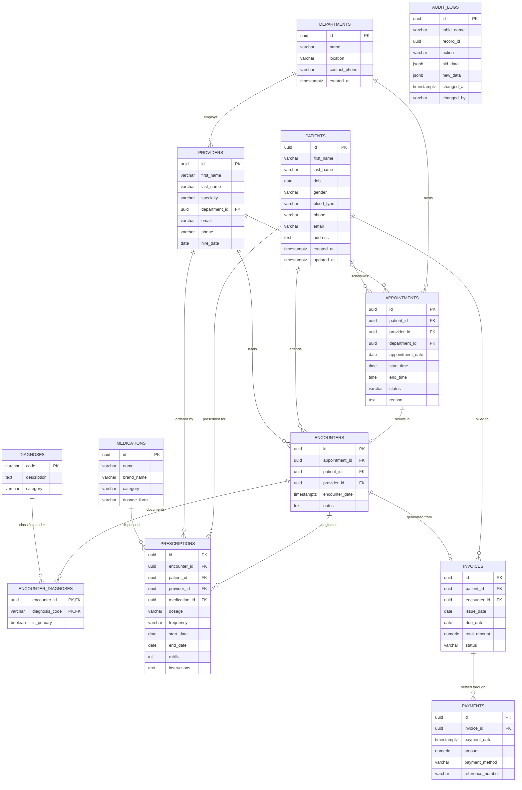

# MediCore - Enterprise PostgreSQL Healthcare Database

MediCore is a relational healthcare database layer built on **PostgreSQL 15+**. It features a 3NF-normalized schema designed to model clinical workflows, patient scheduling, encounters, diagnoses, pharmacy prescriptions, billing, and audit tracking.

---

## 📊 Entity Relationship Diagram (ERD)



---

## 🗂 Database Schema & Structure

All SQL scripts reside under [`data/db/`](file:///c:/Users/MOHAMMED%20AFFAN/OneDrive/Desktop/Projects/medicore/data/db/):

| Script | Description |
|---|---|
| [`schema.sql`](file:///c:/Users/MOHAMMED%20AFFAN/OneDrive/Desktop/Projects/medicore/data/db/schema.sql) | Creates and initializes the `healthcare` schema and enables the `uuid-ossp` extension. |
| [`tables.sql`](file:///c:/Users/MOHAMMED%20AFFAN/OneDrive/Desktop/Projects/medicore/data/db/tables.sql) | DDL for 12 normalized tables: `departments`, `providers`, `patients`, `appointments`, `encounters`, `diagnoses`, `encounter_diagnoses`, `medications`, `prescriptions`, `invoices`, `payments`, and `audit_logs`. |
| [`constraints.sql`](file:///c:/Users/MOHAMMED%20AFFAN/OneDrive/Desktop/Projects/medicore/data/db/constraints.sql) | Foreign key relational integrity, cascade behaviors, and validation rules (`CHECK` constraints for appointment start/end, status enums, amounts). |
| [`indexes.sql`](file:///c:/Users/MOHAMMED%20AFFAN/OneDrive/Desktop/Projects/medicore/data/db/indexes.sql) | Optimized B-Tree and partial indexes for schedule lookups, patient search, status queries, and foreign keys. |
| [`functions.sql`](file:///c:/Users/MOHAMMED%20AFFAN/OneDrive/Desktop/Projects/medicore/data/db/functions.sql) | 3 PL/pgSQL functions: `calculate_patient_age()`, `get_outstanding_balance()`, and `is_provider_available()`. |
| [`procedures.sql`](file:///c:/Users/MOHAMMED%20AFFAN/OneDrive/Desktop/Projects/medicore/data/db/procedures.sql) | 2 Transactional stored procedures: `schedule_appointment()` and `process_payment()`. |
| [`triggers.sql`](file:///c:/Users/MOHAMMED%20AFFAN/OneDrive/Desktop/Projects/medicore/data/db/triggers.sql) | 3 Business triggers: automated invoice settlement on payment, provider double-booking prevention, and audit logging on patient mutations. |
| [`views.sql`](file:///c:/Users/MOHAMMED%20AFFAN/OneDrive/Desktop/Projects/medicore/data/db/views.sql) | 5 Analytical reporting views: `v_patient_summary`, `v_provider_schedule`, `v_monthly_revenue`, `v_appointment_statistics`, and `v_prescription_history`. |
| [`queries.sql`](file:///c:/Users/MOHAMMED%20AFFAN/OneDrive/Desktop/Projects/medicore/data/db/queries.sql) | 10 Complex analytical queries demonstrating CTEs, window functions (`ROW_NUMBER`, `LAG`, `SUM OVER`), subqueries, and multi-table joins. |
| [`seed.sql`](file:///c:/Users/MOHAMMED%20AFFAN/OneDrive/Desktop/Projects/medicore/data/db/seed.sql) | Realistic synthetic clinical data (~9.7 MB) generated via [`data/scripts/generate_seed_data.py`](file:///c:/Users/MOHAMMED%20AFFAN/OneDrive/Desktop/Projects/medicore/data/scripts/generate_seed_data.py). |

---

## 📈 Synthetic Dataset Scale

- **Patients**: 5,500 records
- **Providers**: 25 healthcare practitioners
- **Departments**: 10 clinical hospital divisions
- **Diagnoses**: 20 ICD-10 standardized codes & descriptions
- **Medications**: 50 clinical pharmaceutical formulations
- **Appointments**: 12,000 scheduled & historical bookings
- **Encounters & Diagnoses**: 7,000+ completed visits with multi-tier primary & secondary diagnoses
- **Prescriptions**: 4,000+ active and completed medication orders
- **Invoices & Payments**: Full billing ledger with complete and partial settlement records

---

## 🚀 Execution & Setup Instructions

When Docker Desktop is launched, initialize the container and load the database with the following steps:

### 1. Start the PostgreSQL Container
```powershell
docker compose up -d
```

### 2. Execute SQL Scripts in Sequence
```powershell
# Execute core DDL & schema
docker exec -i medicore_db psql -U medicore_user -d medicore -f /dev/stdin < data/db/schema.sql
docker exec -i medicore_db psql -U medicore_user -d medicore -f /dev/stdin < data/db/tables.sql
docker exec -i medicore_db psql -U medicore_user -d medicore -f /dev/stdin < data/db/constraints.sql
docker exec -i medicore_db psql -U medicore_user -d medicore -f /dev/stdin < data/db/indexes.sql

# Install functions, procedures, triggers, views
docker exec -i medicore_db psql -U medicore_user -d medicore -f /dev/stdin < data/db/functions.sql
docker exec -i medicore_db psql -U medicore_user -d medicore -f /dev/stdin < data/db/procedures.sql
docker exec -i medicore_db psql -U medicore_user -d medicore -f /dev/stdin < data/db/triggers.sql
docker exec -i medicore_db psql -U medicore_user -d medicore -f /dev/stdin < data/db/views.sql

# Seed data
docker exec -i medicore_db psql -U medicore_user -d medicore -f /dev/stdin < data/db/seed.sql
```

### 3. Re-generating Data (Optional)
To regenerate fresh synthetic data with custom batch sizes:
```powershell
python data/scripts/generate_seed_data.py
```
